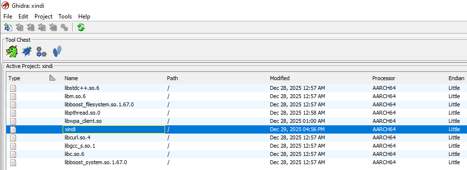
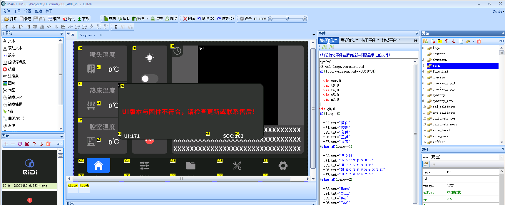

# klipmi

[Klip]per for H[MI] displays like TJC and Nextion

# ⚠️ WARNING

**absolutely no guarantees, you do everything at your own risk.**  

This is **work in progress**. Do not use any of these software or instructions unless you know what you're doing!
These modifications are for experienced users. If you are not comfortable with a command line, linux, and electronics, please stop here!

## Overview

`klipmi` is a framework for integrate Klipper with HMI displays such as TJC and Nextion.

This repository contains the necessary code and configuration files to build klipper support for the Qidi Plus 4 stock TJC displays.

## Features

- Handles TJC/Nextion diplay communication
- Handles interacting with moonraker
- Provides a simplified framework for interacting with both

# Supported HMIs

Currently klipmi supports:
- OpenP4 for TJC8048X250_011C_I_Z03

## Prerequisite

### Install Python 3.13 venv

```bash
sudo apt install python3.13-venv
```
 
### Set legacy console to display

Default legacy console is [tty0]

```bash
sudo dmesg | grep legacy
[    0.001065] printk: legacy console [tty0] enabled
```

Set legacy console to display

```bash
sudo nano /boot/armbianEnv.txt
console=display
reboot
```

Legacy console is now [tty1]

```bash
sudo dmesg | grep legacy
[    0.001049] printk: legacy console [tty1] enabled
```

## Install klipmi

To install `klipmi`, follow these steps:

1. Clone the repository:
    ```bash
    cd ~
    git clone https://github.com/ctbenergy/qidi-plus4-klipmi.git klipmi
    cd klipmi
    ```

2. Run the installation script:
    ```bash
    ./install.sh
    ```

3. Configure `klipmi` by editing the example configuration file:
    ```bash
    cp klipmi.toml.example ~/printer_data/config/klipmi.toml
`   ``
4. Get moonraker API key
    ```
    http://IP OF PRINTER/access/api_key
    ```

    Retrieve the API Key via the command line (SSH):¶
    ```
    cd ~/moonraker/scripts
    ./fetch-apikey.sh
    ```

## Install Touch Screen Firmware

The V1.7.1 TFT Firmware [xindi_800_480.tft](https://github.com/QIDITECH/QIDI_PLUS4/blob/main/UI/xindi_800_480.tft) is the latest open source firmware for the Quidi Plus 4.

This version is also included in this repository under **hmi/openp4/xindi_800_480_V1.7.1.tft**

```bash
mks@mkspi:~$ cd ~/klipmi/.venv/bin
mks@mkspi:~/klipmi/.venv/bin$ ~/klipmi/.venv/bin/python nextion-fw-upload -b 115200 -ub 921600 /dev/ttyS1 /home/mks/klipmi/hmi/openp4/xindi_800_480_V1.7.1.tft
2025-12-27 19:56:12,663 INFO     nextion.nextion.client Connecting: /dev/ttyS1, baud: 115200
2025-12-27 19:56:12,666 INFO     nextion.nextion.protocol.base Connected to serial
2025-12-27 19:56:12,720 INFO     nextion.nextion.client Address: 1281-0
2025-12-27 19:56:12,721 INFO     nextion.nextion.client Detected model: TJC8048X250_011C
2025-12-27 19:56:12,721 INFO     nextion.nextion.client Firmware version: 136
2025-12-27 19:56:12,722 INFO     nextion.nextion.client Serial number: 01FE340151216560
2025-12-27 19:56:12,722 INFO     nextion.nextion.client Flash size: 33554432-0
2025-12-27 19:56:12,729 INFO     nextion.nextion.client Successfully connected to the device
2025-12-27 19:56:12,730 INFO     nextion.nextion.client About to upload 20463712 bytes
2025-12-27 19:56:12,890 INFO     nextion.nextion.client Reconnecting at new baud rate: 921600
2025-12-27 19:56:12,897 ERROR    nextion.nextion.protocol.base Connection lost
2025-12-27 19:56:12,899 INFO     nextion.nextion.protocol.base Connected to serial
2025-12-27 19:56:13,169 INFO     nextion.nextion.client Device is ready to accept upload
2025-12-27 19:56:13,445 INFO     nextion.nextion.client Uploaded: 0.0%
2025-12-27 19:56:13,591 INFO     nextion.nextion.client Uploaded: 0.0%
2025-12-27 19:56:13,657 INFO     nextion.nextion.client Uploaded: 0.1%
...
2025-12-27 19:57:34,358 INFO     nextion.nextion.client Uploaded: 21.9%
2025-12-27 19:57:34,358 INFO     nextion.nextion.client Successfully uploaded 4477024 bytes
```

## Usage

Start the service:

```bash
sudo systemctl start klipmi.service
```

Enable service startup on boot:

```bash
sudo systemctl enable klipmi.service
```

Check logs if service is not working:

```bash
sudo journalctl -xeu klipmi
```

## Development klipmi

1. Stop klipmi service:

```bash
sudo systemctl stop klipmi
```

2. Start klipmi

```bash
~/klipmi/.venv/bin/python ~/klipmi/src/main.py
```

## Development HMI

The V1.7.1 HMI source code [xindi_800_480.HMI]([https://github.com/QIDITECH/QIDI_PLUS4/blob/main/UI/xindi_800_480.HMI) is the latest open source firmware for the Quidi Plus 4.

This version is also included in this repository under **hmi/openp4/xindi_800_480_V1.7.1.HMI**

## Editors

- TJC editor: http://filedown.tjc1688.com/USARTHMI/USARTHMIsetup_latest.zip
- Nextion editor: https://nextion.tech/download/nextion-setup-v1-68-1.zip

Project path

```bash
C:\Projects\TJC\xindi_800_480_V1.7.1.HMI"
```

## Reverse engineering

[Ghidra](https://github.com/NationalSecurityAgency/ghidra) is a software reverse engineering (SRE) framework.

Ghidra is used for decompile and reverse engineering of xindi.

### VMware Workstation

Windows 10 Pro with Ghidra, TJC editor (USART HMI) Nextion editor installed.

#### Ghidra



Project path

```bash
C:\Projects\Ghidra\xindi-v1.7.1
```

Import libraries

```bash
C:\Projects\Ghidra\armbian-22.05.0\usr\lib
C:\Projects\Ghidra\armbian-22.05.0\usr\lib\aarch64-linux-gnu\libcurl.so.4
C:\Projects\Ghidra\armbian-22.05.0\usr\lib\aarch64-linux-gnu\libstdc++.so.6
C:\Projects\Ghidra\armbian-22.05.0\usr\lib\aarch64-linux-gnu\libm.so.6
C:\Projects\Ghidra\armbian-22.05.0\usr\lib\aarch64-linux-gnu\libboost_system.so.1.67.0
C:\Projects\Ghidra\armbian-22.05.0\usr\lib\aarch64-linux-gnu\libboost_filesystem.so.1.67.0
C:\Projects\Ghidra\armbian-22.05.0\usr\lib\aarch64-linux-gnu\libgcc_s.so.1
C:\Projects\Ghidra\armbian-22.05.0\usr\lib\aarch64-linux-gnu\libc.so.6
C:\Projects\Ghidra\armbian-22.05.0\usr\lib\aarch64-linux-gnu\libpthread.so.0
C:\Projects\Ghidra\armbian-22.05.0\usr\lib\libwpa_client.so
```

#### TJC editor (USART HMI)



Project path

```bash
"C:\Projects\TJC\xindi_800_480_V1.7.1.HMI"
```

## Troubleshooting

If you encounter the error: `No such file or directory: '/root/printer_data/config/klipmi.toml'`

1. Edit the service configuration:

```bash
sudo nano /etc/systemd/system/klipmi.service
```

2. Change the service user to `mks`

3. Restart the service:

```bash
sudo systemctl restart klipmi
```

### Useful commands

SysRq Kernel config

```bash
grep -i sysrq "/boot/config-$(uname -r)"
CONFIG_MAGIC_SYSRQ=y
CONFIG_MAGIC_SYSRQ_DEFAULT_ENABLE=0x1
CONFIG_MAGIC_SYSRQ_SERIAL=y
CONFIG_MAGIC_SYSRQ_SERIAL_SEQUENCE=""
```

To check the current value:

```bash
cat /proc/sys/kernel/sysrq
1
```

Check your current consoles

```bash
cat /proc/consoles
tty1                 -WU (EC  p  )    4:1
```

```bash
sudo dmesg | grep ttys*
[    0.001075] printk: legacy console [tty1] enabled
[    1.059300] ff110000.serial: ttyS0 at MMIO 0xff110000 (irq = 21, base_baud = 1500000) is a 16550A
[    1.062110] ff120000.serial: ttyS1 at MMIO 0xff120000 (irq = 22, base_baud = 1500000) is a 16550A
[    1.064754] ff130000.serial: ttyS2 at MMIO 0xff130000 (irq = 23, base_baud = 1500000) is a 16550A
```

```bash
systemctl | grep getty
  getty@tty1.service    loaded active running   Getty on tty1
  system-getty.slice    loaded active active    Slice /system/getty
  getty.target          loaded active active    Login Prompts
```

```bash
lsusb
Bus 001 Device 001: ID 1d6b:0002 Linux Foundation 2.0 root hub
Bus 002 Device 001: ID 1d6b:0002 Linux Foundation 2.0 root hub
Bus 002 Device 002: ID a69c:5721 aicsemi Aic MSC -> WLan Stick
Bus 003 Device 001: ID 1d6b:0003 Linux Foundation 3.0 root hub
Bus 004 Device 001: ID 1d6b:0002 Linux Foundation 2.0 root hub
Bus 004 Device 002: ID 1a40:0101 Terminus Technology Inc. Hub
Bus 004 Device 003: ID 04d8:e72b Microchip Technology, Inc. Beacon RevH
Bus 004 Device 004: ID 32e6:9221 icSpring icspring camera -> USB camera
Bus 005 Device 001: ID 1d6b:0001 Linux Foundation 1.1 root hub

```

## Contributing

Contributions are welcome! Please open an issue or submit a pull request for any changes.

## License

This project is licensed under the GPL-3.0 License. See the [LICENSE](LICENSE) file for details.

